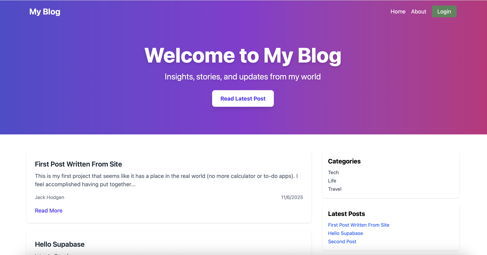

# Supabase Blog

A modern, responsive blog built with **React** and **TailwindCSS**, using **Supabase** as a backend for storing and fetching posts dynamically. This project demonstrates a full-stack approach with a front-end React app and a serverless database backend.

---

## Demo

---

## Features

- Display blog posts from Supabase
- Post detail page with full content
- Sidebar with categories and latest posts
- Responsive layout using TailwindCSS
- Ready for authentication and post creation (future)
